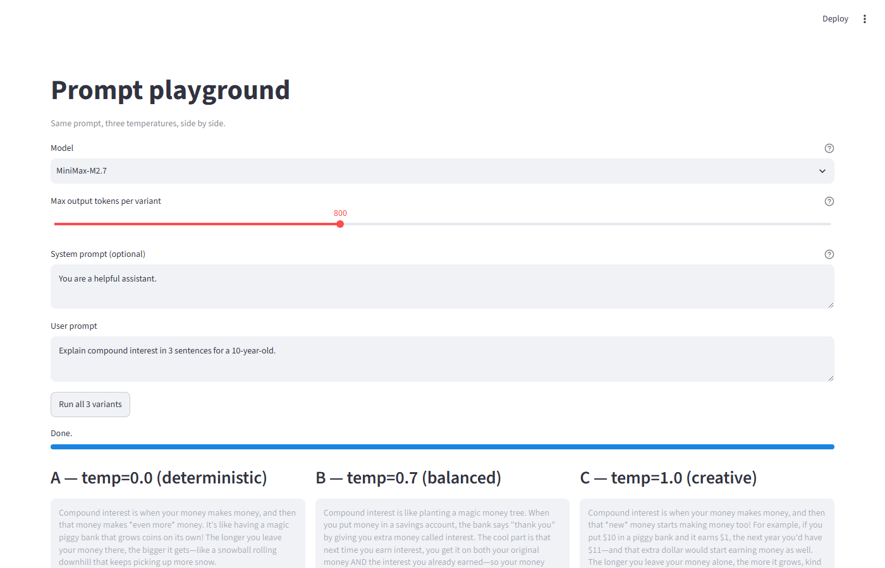
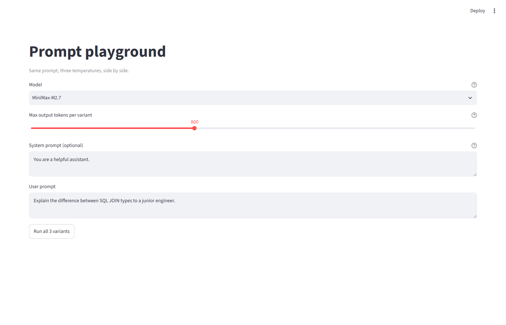

# ai-pm-prompt-lab

**Phase 1 of an 8-week AI PM sprint.** An eval harness + prompt playground built to develop PM intuition about LLM behavior — what models actually do, not what their marketing pages claim.

Built by a product manager learning AI engineering from a builder's perspective. The goal isn't shipping a product; it's building the muscle to evaluate any LLM feature a teammate (or vendor) ships.

---

## What this repo contains

| Component | What it does | Try it |
|---|---|---|
| **Prompt playground** | Streamlit app — type one prompt, see 3 temperature variants side by side | `streamlit run playground.py` |
| **Eval harness** | 10 test cases, 7 scorer types, runs any model against the suite | `python run_eval.py --model MiniMax-M3 --judge-model MiniMax-M3` |
| **Experiments** | Real model comparisons, documented findings | [`experiments/`](./experiments/) |



---

## Quickstart

```bash
git clone https://github.com/mayankkhakkhar/ai-pm-prompt-lab.git
cd ai-pm-prompt-lab
pip install -r requirements.txt

cp .env.example .env
# Edit .env and add your MiniMax API key

# Try the playground
streamlit run playground.py
# Opens http://localhost:8501

# Try the eval harness
python run_eval.py --model MiniMax-M2.7 --judge-model MiniMax-M3
```

---

## The prompt playground

A web UI where you type one prompt, pick a model and a token budget, and see 3 temperature variants run side by side.



**What it teaches:** the same prompt produces visibly different outputs at temp=0.0 (deterministic), 0.7 (balanced), 1.0 (creative). PMs in AI products need this intuition before they can reason about model behavior.

**What it has:**
- Model picker (M2.7, M2.7-highspeed, M2.5, M2.5-highspeed, M2.1, M3)
- Max-output-tokens slider (default 800)
- Side-by-side comparison with latency + token count per variant
- Read-only output boxes so Streamlit can't cache stale state

**Try it:** `streamlit run playground.py`

---

## The eval harness

A CLI that runs a YAML-defined test suite against any model and prints pass rates.

```bash
python run_eval.py --model MiniMax-M2.7 --judge-model MiniMax-M3
```

**Output:**

```
STATUS CASE                           TIME  TOKENS  DETAIL
[PASS] greeting_5_words               3.2s      94  got 5 words, expected 5 (+/-0)
[PASS] capital_france                 1.2s      67  looking for 'paris' in 'paris'
[PASS] largest_planet                 1.5s      98  looking for 'jupiter' in 'jupiter'
[PASS] extract_email                  2.4s     167  matched='jane.smith@company.co.uk'
[PASS] sentiment_positive             1.3s      64  looking for 'positive' in 'positive'
[PASS] summarize_3_bullets            2.4s     188  got 3 bullets, expected 3 (+/-0)
[PASS] json_formatting                2.1s     122  valid JSON with keys ['name', 'age', 'role']
[PASS] explain_concept                1.9s     127  judge (PASS): The response is factually accurate...
[PASS] compare_options_balanced       6.3s     299  judge (PASS): The response covers pros and cons...
[PASS] meeting_summary                4.7s     380  judge (PASS): All criteria are satisfied...

Pass rate:    10/10 (100%)
Avg latency:  2.71s per case
Total tokens: 1,608
```

Full sample run: [`docs/sample-eval-output.txt`](./docs/sample-eval-output.txt)

### 7 scorer types

`exact`, `contains`, `regex`, `word_count`, `bullet_count`, `json_valid`, `llm_judge`

The `llm_judge` scorer is the interesting one — it makes a second API call to a judge model and asks it to evaluate against a rubric. Useful for qualitative tests like "is this explanation age-appropriate?"

### Test cases in `evals/sample-set.yaml`

- **Format constraints** — word count, bullet count, JSON structure
- **Knowledge retrieval** — capital cities, planets
- **Extraction** — pull an email from prose
- **Classification** — sentiment
- **Qualitative (LLM-judge)** — explain concepts, compare options, summarize meetings

### Flags

```
--model MiniMax-M3        # test model (defaults to $MINIMAX_MODEL)
--judge-model MiniMax-M3  # judge model (defaults to test model — usually bad)
--case meeting_summary    # run one case
--no-judge                # skip LLM-judge cases (faster, cheaper)
--evals path/to/set.yaml  # use a different eval set
```

---

## The experiments

Documented comparisons and findings in [`experiments/`](./experiments/).

| # | Title | Finding |
|---|---|---|
| 01 | [3-model eval comparison](./experiments/01-3-model-eval-comparison.md) | M2.7 vs M2.7-highspeed vs M3 — M2.7 is the sweet spot |

---

## What we learned (the PM lessons)

These are findings from building this lab. Not opinions — measurements.

### 1. The judge matters more than you think

M2.7-as-judge was unreliable — it over-thinks and returns empty. Switching the judge to M3 unlocked 2 cases that had been failing. **Lesson:** in production, "AI evaluates AI" needs a trustworthy evaluator. Don't use the cheapest model for judging.

### 2. M2.7 is the sweet spot for most prompts

On our 10-case suite, M2.7 hit the same 10/10 as M3 while using **2.4x fewer tokens**. M3 wasn't better — just more verbose. **Lesson:** when evaluating models, measure cost and quality together. A "bigger" model isn't a "better" model for the task.

### 3. "Fast" models aren't free

M2.7-highspeed was the fastest (2.92s/case) but scored 8/10 instead of 10/10. The "highspeed" optimization trades reasoning quality for latency. **Lesson:** vendor "speed tier" pitches usually hide a quality cut.

### 4. Token budget = output completeness

M2.7 emits a `` block before answering. That reasoning eats into the token cap. At `max_tokens=300`, the visible answer often cuts off mid-sentence. At 800, complete answers. **Lesson:** budget for AI products must include reasoning overhead — typically 60-70% of the cap is invisible to the user.

### 5. Eval scores have variance

M2.7 scored 9/10 on one run, 10/10 on the next — same eval, same model, same temperature. **Lesson:** never ship a "model X is better than Y" claim from one eval run. N=3 minimum for any conclusion.

### 6. Prompts have ceilings

The `meeting_summary` case initially required M2.7 to extract 3+ action items, but it returned 2. Even after sharpening the system prompt, M2.7's reasoning rejected "the team decided to postpone X" as "a decision, not an action item." **Lesson:** reasoning models can over-rule surface instructions. Sometimes the right fix is a stronger model, not a better prompt.

---

## Repo structure

```
ai-pm-prompt-lab/
├── hello_minimax.py            # Day 1 sanity check
├── show_request.py             # Inspect outgoing HTTP request (no API call)
├── playground.py               # Streamlit prompt playground
├── run_eval.py                 # Eval harness CLI
├── eval/
│   ├── parser.py               # Strip <think>...</think> from model output
│   └── scorers.py              # 7 scorer implementations
├── evals/
│   └── sample-set.yaml         # 10 eval cases
├── experiments/
│   └── 01-3-model-eval-comparison.md
├── docs/
│   ├── screenshots/            # For the README
│   └── sample-eval-output.txt  # Frozen eval run output
├── scripts/
│   └── capture_screenshots.py  # Playwright-based screenshot script
├── requirements.txt
├── .env.example
├── .gitignore                  # .env is gitignored
└── LICENSE                     # MIT
```

---

## The 5 questions this lab trains you to answer

After Phase 1, you should be able to evaluate any LLM feature on:

1. **Latency** — p50, p95 of end-to-end response
2. **Cost** — per query, per user, monthly burn
3. **Quality** — pass rate on a representative test set
4. **Variance** — does `temperature=0` give consistent outputs?
5. **Failure modes** — what's the worst output you've seen, and how do you detect it?

---

## Status

| Component | Status |
|---|---|
| Eval harness (10 cases, 7 scorers) | ✅ done |
| Prompt playground (model picker, temp sweep, max_tokens) | ✅ done |
| 3-model comparison | ✅ done |
| Variance experiments (N=3 per model) | 🚧 next |
| PM-flavored eval cases | 🚧 planned |
| LangChain / RAG (Phase 2) | ⏳ pending |
| AI Agents (Phase 3) | ⏳ pending |

---

## License

MIT — see [`LICENSE`](./LICENSE).
